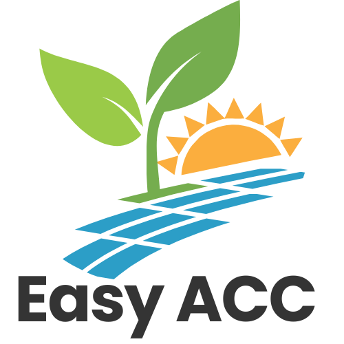

 <p align="center">
  
</p>
 

# Projet d’Autoconsommation Collective (ACC)

<p align="center">
  
  
</p>

## Partenaires du projet

### Entités participantes

* IMT Atlantique
* ALECOB

### Client

* **ALECOB**

  Représentant : *Thomas PICOUET*

### Encadrement académique

* **IMT Atlantique**


  Tuteur : *Laurent BRISSON*

---

---

## Présentation du projet

Ce projet s’inscrit dans le cadre d’un **projet étudiant** réalisé à **IMT Atlantique**, en collaboration avec l’**ALECOB** (Agence Locale de l'Énergie du Centre Ouest Bretagne).

L’objectif est de concevoir une solution permettant de **collecter, traiter, analyser et visualiser des données liées à une communauté d’autoconsommation collective (ACC)**. Le système vise à faciliter la compréhension et l’optimisation de la production et de la consommation d’énergie à l’échelle locale.

---

## Équipe projet

* Alexandre DELHOMMEAU
* Quentin DENIS
* Clément FORNAGE
* Sushant POKHAREL

---

## Documentation

Toute la documentation du projet est centralisée dans le dossier :

```
/documentation
```

Ce dossier contient :

* 🚀 [Guide d'installation et de démarrage](Documentation/Guide_d'installation_et_de_démarrage.pdf)
* 🧑‍💻 [Guide d'utilisation](Documentation/Guide_d'utilisation.pdf)
* 🛠️ [Documentation technique](Documentation/Documentation_technique.pdf)

Nous recommandons de consulter ces documents pour :

* installer correctement l’environnement
* comprendre l’architecture du projet
* utiliser les différentes fonctionnalités
* approfondir les choix techniques

---

## Objectifs du projet

* Collecter des données énergétiques (production et consommation)
* Traiter ces données en temps réel
* Paramétrer différents scénarios
* Visualiser les indicateurs clés (production, consommation, surplus, partage)
* Aider à la prise de décision dans une communauté ACC

---

## Architecture (résumé)

Le projet repose sur plusieurs composants typiques d’un pipeline data :

* ingestion de données
* traitement
* stockage
* visualisation (dashboard)

👉 Plus de détails dans la documentation technique.

---

## 🚀 Pour commencer

👉 Rendez-vous dans le dossier `/documentation` pour suivre les instructions complètes.


